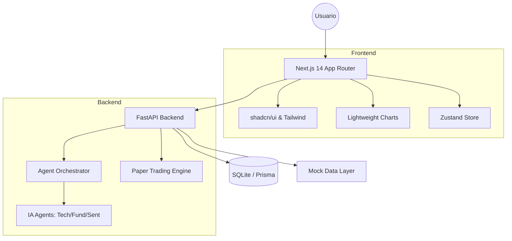

# Arquitectura del Sistema

El ecosistema FinAI está diseñado bajo una arquitectura de microservicios desacoplados para garantizar escalabilidad y modularidad.

## Diagrama de Arquitectura

## Componentes Clave

1.  **Frontend (Next.js 14)**: Maneja la visualización de datos de alta fidelidad y la interacción del usuario.
2.  **Orquestador de Agentes (FastAPI)**: Ejecuta la lógica de negocio de IA, coordinando múltiples modelos para generar un análisis cohesivo.
3.  **Capa de Persistencia (Prisma + SQLite)**: Garantiza que el MVP sea autónomo y portable, almacenando configuraciones de agentes y portafolios.
4.  **Motor de Trading**: Lógica aislada para simular operaciones financieras sin riesgo real.
